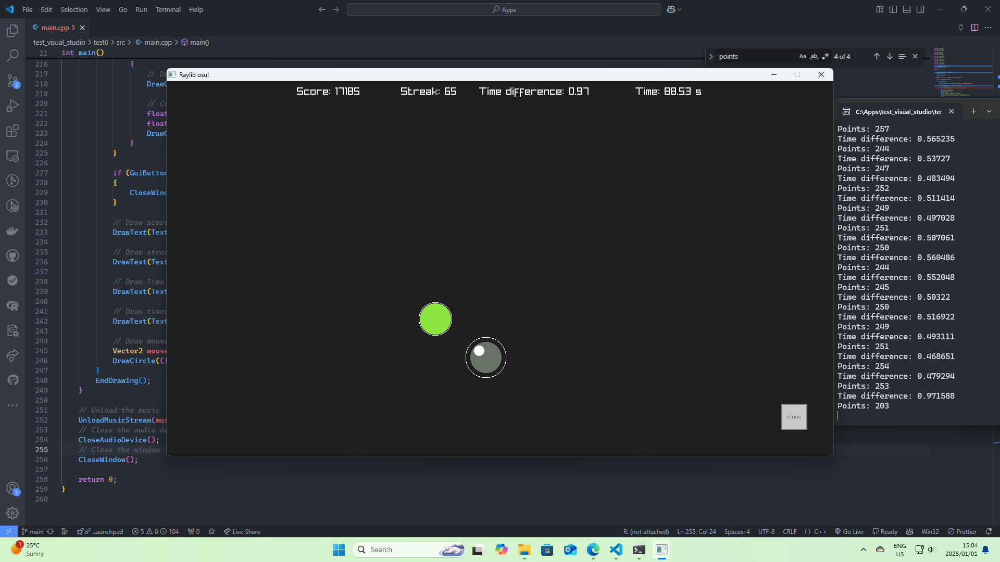

# Raylib-osu

A simple osu! clone made with raylib.

```
Download any song to the current directory and name it "input.mp3".
A beatmap will be generated automatically synced to the beat of the song.
There is a sample input.mp3 provided.
```

## Linux

### Prerequisites

```bash
sudo apt install wget
sudo apt install curl
sudo apt install cmake
sudo apt install ffmpeg
sudo apt install aubio-tools libaubio-dev libaubio-doc
```

### How to run

```bash
git clone https://github.com/JanDalhuysen/raylib-osu.git
cd raylib-osu
cmake .
make
./raylib-osu
```

## Windows

### Prerequisites

```bash
winget install -e --id JernejSimoncic.Wget
winget install -e --id cURL.cURL
winget install -e --id Gyan.FFmpeg
winget install -e --id Kitware.CMake
```

### How to run

```bash
git clone https://github.com/JanDalhuysen/raylib-osu.git
cd raylib-osu
cmake . -G "MinGW Makefiles"
mingw32-make
raylib-osu.exe
```



## Python auto player (experimental)

This project includes `auto_osu.py`, a screen-reading bot for this Raylib osu clone.

### Important: Build the native keyboard helper first (Windows)

For reliable keyboard input, build the `send_key.exe` helper program:

```bash
cmake . -G "MinGW Makefiles"
mingw32-make
```

This creates `send_key.exe` which uses Windows SendInput API for reliable keyboard input that Raylib will recognize.

### Install dependencies

```bash
python -m pip install opencv-python numpy pyautogui pillow pydirectinput pygetwindow
```

### Run

```bash
python auto_osu.py
```

**Auto window focus (RECOMMENDED):**

The bot will automatically focus the "Raylib osu!" window before starting (default behavior).

```bash
# Auto-focus the default "Raylib osu!" window
python auto_osu.py

# Or specify a custom window title
python auto_osu.py --focus-window "My Custom Title"

# Disable auto-focus (manual focus)
python auto_osu.py --focus-window ""
```

If auto-focus works, the game window will be activated automatically and clicks should register. No need to manually click the window first!

Live debug overlay is enabled by default (left = captured frame + detections, right = mask). Debug window is 50% scaled for visibility.
Press `q` to stop the bot.

### Troubleshooting clicks not registering

If the bot moves the mouse accurately but clicks don't register, try these in order:

**Option 1: Use native keyboard input (BEST - uses Windows SendInput API)**

```bash
python auto_osu.py --keyboard
```

This uses the `send_key.exe` helper which sends Z/X keys via Windows SendInput API - the most reliable method. Make sure you've built it first (see above).

**Option 2: Use pydirectinput (bypasses Windows input queue)**

```bash
python auto_osu.py --pydirectinput
```

Sends clicks directly to the OS instead of through the normal Windows input queue.

**Option 3: Add a small delay before clicking**

```bash
python auto_osu.py --click-delay 0.05
```

Try values like `0.01`, `0.05`, or `0.1` seconds. Can be combined with other modes:

```bash
python auto_osu.py --keyboard --click-delay 0.05
```

### Other tuning options

```bash
# Lock to a specific screen region (faster performance)
python auto_osu.py --region 320 180 1280 720

# Disable debug overlay
python auto_osu.py --no-debug

# Adjust circle detection
python auto_osu.py --min-radius 15 --max-radius 45 --sat-min 50 --val-min 40
```

Stop safely by moving the mouse to the top-left corner of your main display (fail-safe) or press `q` in the debug window.
